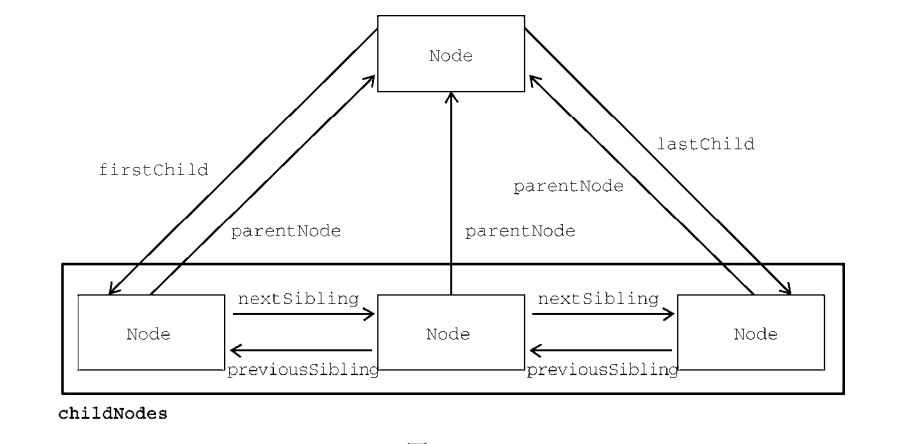

# javascript note

## Chapter 1 Intro

   js主要包含了三类:   
   + ECMAScript:核心.  
   + DOM：文档对象模型.    
   + BOM：浏览器对戏那个模型.s   


## Chapter 3 变量相关

var和let的区别主要是
   1.变量提升
   2.在开发过程中会有重复命名的情况（多人协作情况下），var则不会报错，用let更好。
   3.let的作用域主要是块作用域，var主要是函数作用域。

##  Chapter 14 DOM 


### 14.1 node类型

#### 14.1.1 nodeType

+ Node.ELEMENT_NODE（1）

+ Node.ATTRIBUTE_NODE（2）

+ Node.TEXT_NODE（3）

+ Node.CDATA_SECTION_NODE（4） 

+ Node.ENTITY_REFERENCE_NODE（5）

+ Node.ENTITY_NODE（6）

+ Node.PROCESSING_INSTRUCTION_NODE（7）

+ Node.COMMENT_NODE（8）

+ Node.DOCUMENT_NODE（9）

+ Node.DOCUMENT_TYPE_NODE（10）

+ Node.DOCUMENT_FRAGMENT_NODE（11）

+ Node.NOTATION_NODE（12）

节点类型可通过与这些常量比较来确定，比如：  

if (someNode.nodeType == Node.ELEMENT_NODE){  

 	   alert("Node is an element.");  
 	}    
 	
这个例子比较了someNode.nodeType与Node.ELEMENT_NODE常量。如果两者相等，则意味着someNode是一个元素节点。  

#### 14.1.2 nodeName / nodeValue

每一个节点又都有两个属性
someNode.nodeName //元素的标签名字（比如p，span，body，head）  
someNode.nodeValue//元素的value

比如以下代码：  

```html
<body>
   <div class="container1">
      <div>
         123
      </div>
   </div>
<\body>
```

```javascript
<script>
var a = document.querySelector(".container1");
   console.log(a.nodeType);
   console.log(a.nodeName);
   **console.log(a.nodeValue); **
   console.dir(a)
</script> 
```

则会分别打印
1 ， DIV ， null ， 此节点的所有属性


#### 14.1.3 节点关系

   

#### 14.1.4 节点操作

   1.比较常用的是appendChild()  
   + 需要注意的是，添加节点之后返回的节点，就是添加的节点  
   + **并且添加之后这个节点在父节点的末尾**   

   `let returnedNode = someNode.appendChild(newNode);   
    alert(returnedNode == newNode); // true   
    alert(someNode.lastChild == newNode); // true `    

   2.insertBefore()  
   + 此操作两个参数，第一个是插入的节点，第二个是参照节点，若参照节点为null则此方法视为appendChild   
   + 添加节点之后返回的节点，就是添加的节点。   

   3.someNode.childNodes[x]  
   + 返回对应位置的node，x为其index。  

   4.replaceChild()  
   + 同样两个参数，插入的节点和需要取代的节点。  

   5.removeChild()  
   + 一个参数，需要注意的是返回的节点就是被移除的节点    

   6.cloneNode()
   + 传入false或者true,深浅拷贝

### 14.2 document类型

   它的属性：  
   nodeTyple 9
   nodeName 值为"#document"
   nodeValue 值为null
   parentNode 值为 null； 
   ownerDocument 值为 null；  

   1.获取html这个最外层的节点的方式：    
   + let html = document.documentElement;     
   + alert(html === document.childNodes[0]);  true    
   + alert(html === document.firstChild);   true   

   2.document.body     //直接指向body    
     document.title    //指向文档的title  
     document.URL  
     document.domain   //获取www.baidu.com/123/abc 中的www.baidu.com
     document.referrer  

   3.getElementById("")  //没找到返回null  
     getElementByTag("") // 比如传入img  div  
     getElementByName("")   

### 14.3 Element类型  

   nodeType 等于 1；    
   nodeName 值为元素的标签名；  
   nodeValue 值为 null；  
   parentNode 值为 Document 或 Element 对象；  

### 14.3 text类型

   nodeType 3;   
   nodeName  "text"    
   nodeValue  为节点中包含的文本。  
   parentNode 为element对象      
   不支持子节点  


## Chapter 15 DOM 扩展   

### 15.1 selectors API  
   
+ querySlector()   
+ querySlectorAll()   
   //id 为 #   
   //class 为 .  
   //标签没有前缀  

### 15.2 CSS 扩展  

   + getElementsByClassName();   
     比如：  
     document.getElementsByClassName("username current")   //取所有类名中包含username和current的元素  
     document.getElementById("myDIv").getElementsByClassName("selected");   //取id为myDiv的元素子树中所有包含selected类的元素  

   + classList  
     classList.add()  
     classList.remove()  
     classList.toggle(value)     //如果类名列表有value，则删除，如果不存在，则添加  
     classList.contains()  

   + readyState
     document.readyState =="complete" 文档加载完成     
     document.readyState =="loading" 文档加载正在进行    

   + innerHTML 返回元素所有后代的html字符串   
               也会替换原来所包含的所有节点   

   + outerHTML 调用的话会调用完整的node树   
               写入的时候会完全取代原来的树   

   + insertAdjacentHTML()   
     insertAdfacentText()   
     都需要传入两个参数：  要插入标记的位置， 要插入的html或者文本  

       “beforebegin” 插入当前元素千遍，作为前一个同胞节点  
       “afterend“    插入当前元素后边，作为下一个同胞节点  
       “afterbegin”  插入当前元素内部，作为新节点或者第一个子节点千遍  
       “beforeend”   插入元素内部，作为新的子节点或者放在最后一个子节点后边  

   + innerText  获取返回所有的text的字符串  
                在设置和写入的时候会移除之前所有的后代节点，完全改变dom树  
     outerText  只是作用范围不同，outer包含了调用它的节点。  

## Chapter 17 事件  
   
###   17.1 DOM事件对象
   ```html
   btn.onclick = function(){
      console.log(this.id)
   }
   ```
   多次写同样的点击事件会按照顺序执行  

   **event对象是传给事件处理程序的唯一参数。**  
   比如：  
   first.addEventListener("click", function(event){  
   alert("哈哈哈哈");  

### 17.2 DOM事件对象

   + addEventListener()     
   + removeEventListener()  
      - click  
      - mouseover  
      - mouseout  
 
   他们接受三个参数：事件名， 事件处理函数， 一个boolean  
      - true 在捕获阶段调用    
      - false 在冒泡阶段调用  
   通过addEventListener()添加的事件只能通过removeEventListener来移除并且必须添加同样的参数。  
   所以匿名函数无法移出。  

### 17.3 IE事件对象

   + attachEvent()  
   + detachEvent()  
      - onclick  

   + stopPropogation() 例子如下：     

   ```html
   <body>
        <ul class="container">containner
            <li class="first">first</li>
            <li>second</li>
        </ul>
        <script type="text/javascript">
           let container = document.querySelector(".container")
           let first = document.querySelector(".first")
           first.addEventListener("click", function(event){
            alert("哈哈哈哈");
            // event.stopPropagation();
           })
           container.addEventListener("click", function(){
            alert("呜呜呜呜");
           })     
        </script>
   </body>  
   ```
   以上事例展示了stop Propagation的功能，组织往父级元素传播


### 17.4 事件类型

   + 用户界面事件（UIEvent）：涉及与BOM交互的通用浏览器事件
   + 焦点事件（FocusEvent）：在元素获得和失去焦点时触发
   + 鼠标事件（MouseEvent）： 使用鼠标在页面上执行某些操作时触发
   + 滚轮事件（WheelEvent）： 使用鼠标滚轮时候触发
   + 输入事件（InputEvent）： 文档中输入文本时候触发
   + 合成事件（CompositionEvent）： 在使用某种Input Method Editor 输入法编辑器输入字符时候触发

   


