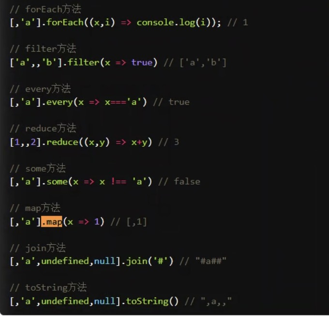

# js note


## 1 函数
```html
<body>
	<script type="text/javascript">
		btn.addEventLisenter("click", function abc(){
			console.log(btn.tagName);
		})
		btn.addEventLisenter("click", function(){
			console.log(btn.tagName);
		})

		// btn.addEventLisenter("click", (){
		// 	console.log(btn.tagName);
		// })

		btn.addEventLisenter("click", ()=>{
			console.log(btn.tagName);
		})
	</script>
</body>
```
以上三者的区别

## 2 函数与函数体

function (){} //报错
(function(){}) //不报错
function f(x) {return x+1} ()  //报错
function f(x) {return x+1} (1) //不报错，为什么返回1 

## 3 箭头函数
为什么要用
 + 箭头函数是匿名函数，不能作为构造函数，不能使用new
 +  1）箭头函数没有自己的this对象
 + （3）不可以使用arguments对象，该对象在函数体内不存在。如果要用，可以用 rest 参数代替


## 5 ES6 完整版详解

[ES6](https://es6.ruanyifeng.com/#docs/promise)

## 6 同步任务与异步任务
	
	js 的 同步任务 异步任务  
	              异步任务又分为：宏任务 微任务  

	典型的宏任务 包括整体代码script，setTimeout() setIntervel()  ，IO  
	微任务是Promise，process.nextTick  
	微任务的执行时机要比宏任务来的早
[详解1](https://www.bilibili.com/video/BV1CA411V791?from=search&seid=13959033135384420900&spm_id_from=333.337.0.0)
[详解2](https://www.jianshu.com/p/0652db9cfb46)	
[详解3](https://juejin.cn/post/6844903512845860872)

## 7 Promise

	promise 函数。 有点类似if else，去执行不同的方法。 把异步任务改为同步任务。async 改成awaite ，只有promise可以改        
	
## 8 String
	string转换数字直接-0  
	str=str.parseInt()
	
## 9 常用的js方法 对数组进行操作的方法
	for循环等  
     

## 10 js的按对象引用传值

	如果
	var a=b={}
	a="str"
	a和b都会变成“str”

	但是如果是number类型
	var a=b=0 
	a=1
	不会引用传值

	尽量避免引用传值

## 11 js事件冒泡

### 往父级元素冒泡
```javascript
<div class="out">out
        <div class="middle">midlle
            <p class="inner" >inner<p>
        </div>
</div>
<script type="text/javascript">
        let clickOut= document.querySelector(".out")
        let clickMiddle=document.querySelector(".middle");
        let clickInner=document.querySelector(".inner")
        clickOut.onclick=function(){
            console.log('this is out');
        };
        clickMiddle.onclick= function(){
            console.log('this is middle')
        }
        clickInner.onclick=function(event){
            event.stopPropagation();
            console.log('this is inner');
        };
</script>
```
点击inner 依此打印inner middle out

### 12 事件捕获

	js事件捕获一般通过DOM2事件模型addEventListener来实现的：   
	target.addEventListener(type, listener, useCapture)  
	第三个参数是是否用事件捕捉    
```javascript
<div class ="out2">out2
        <p class="middle2">middle2
            <p class="inner2">inner2</p>
        </p>
</div>
<script type="text/javascript">
 		let clickOut2=document.querySelector(".out2");
        let clickMiddle2=document.querySelector(".middle2");
        let clickInner2=document.querySelector(".inner2");
        clickOut2.addEventListener("click",function(){console.log('out2')},true);
        clickMiddle2.addEventListener("click",function(){console.log('middle2')},true);
        clickInner2.addEventListener("click",function(){console.log('inner2')},true);
</script>
```

### 13 map和foreach的区别

	foreach更慢，不会return值，只会对数组中每个元素执行一遍传入的函数，

	map 更快， 会return值
```javascript
<script type="text/javascript">
		let arry= [1,2,3,4];
        console.log(arry);

        arry.forEach(element => {
            console.log(element*2);
        });

        let arry2= arry.map(element => element*2);
        let arry2= arry.map(element=>{
            return element*2;
        })
        console.log(arry2)
</script>
```

### 14 filter()
	也是需要返回的
```javascript
let arr=[2,23,24,255,66]
        let arr1=arr.filter(element=>{
            return element>22;
        })
        console.log(arr1);
```

### 15 闭包

	有了let之后不是太担心，不怕被污染了，以前怕局部变量污染全局变量
	闭包的作用是防止方法外访问方法内的变量
	精髓是每次调用闭包可以执行对变量的更改。

## 16 js prototype
	框架不满足的时候可以改变底层逻辑
	创建新的class，增加对象的属性

	
	
