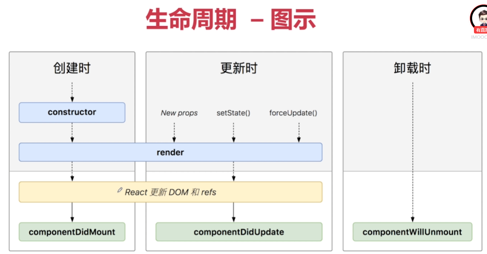

## 1 jsx

	javascript 的语法扩展

	可以使用{} 内嵌任何的 ** javascript expressions **

	是一个语法糖，只是一个object

## 2 jsx的例子

```javascript
import React from 'react';

class Welcome extends React.Component {
    
    render(){
        const toDoList = ['learn react','learn Redux'];
        const isLogin= true;
        return( 
        <div>
            <h1 className="123">hello react</h1>;
            <ul>
            {
                toDoList.map(item =>
                    <li>{item}</li>
                )
            }
            </ul>

            {isLogin ? <p>u have login</p> : <p>no</p> }
        </div>
        )
    }
}

export default Welcome;
```

需要注意的是在html格式里，class 变成className ，for 变成了htmlFor


##	3 react 构建组件的例子 with bootstrap

函数写法
```javascript 
const NameCard = (props) => {
    const {name, number, isHuman, tags}=props;
    return (
        <div className='alert alert-success'>
        <h4>{name}</h4>
        <ul>
            <li>电话:{number}</li>
            <li>{isHuman ? '人类' : '外星人'}</li>
            <p>
                {tags.map((tag,index)=>(
                    <span key={index}>{tag}</span>)
                )}
            </p>
        </ul>
    </div>
    )
}
```

组件写法
```javascript
import React from 'react';

class NameCard extends React.Component {
    render(){
        const {name, number, isHuman, tags}=this.props;
        return(
            <div className='alert alert-success'>
                <h4>{name}</h4>
                <ul>
                    <li>电话:{number}</li>
                    <li>{isHuman ? '人类' : '外星人'}</li>
                    <p>
                        {tags.map((tag,index)=>(
                            <span key={index}>{tag}</span>)
                        )}
                    </p>
                </ul>
            </div>
        )
        
        
    }
}
export default NameCard;
```
## 4 react 自定义组件

	关闭方法：<LikesButton />

## 5 react 的 props/state/forms

	组件内部的数据。可以动态改变

	this.setState()是更新state的唯一途径

	比如以下的点赞按钮的例子
```javascript
	class LikesButton extends React.Component {
    constructor(props) {
        super(props);
        this.state={
            likes:0 
        };
    }
    increaseLikes() {
        alert('Increasing')
        this.setState({ 
            likes: ++this.state.likes
        })
    }
    render() {
        return (
            <div className="likes-button-component">
                <button type="button" className="btn btn-outline-primary btn-lg"
                // onClick={this.increaseLikes}
                onClick={() => { this.increaseLikes()} }
                >
                👍{this.state.likes}
                </button>
            </div>
        )
    }
}
export default LikesButton;
```

** 注意以上代码中的onClick 的箭头函数的使用方法 **

## 6 react 组件的生命周期

	组件初始化 

	组件更新

	组件卸载

	创建-》更新-〉卸载



## 7 react 时钟

    组件生命周期的案例
```javascript
import React from 'react';

class DigitalCloud extends React.Component {
    constructor(props) {
        super(props);
        this.state={
            date: new Date()
        };
    }
    componentDidMount() {
        this.time=setInterval(() =>{ 
            this.setState({
                date:new Date()
            })
        },1000)
    }
    componentDidUpdate(currentProps,currentState){
        console.log(currentState)
    }
    componentWillUnmount(){
        clearInterval(this.timer)
    }
    render() {
        return(
            <div className="digital-Clock-component jumbotron">
                <h1>{this.state.date.toLocaleTimeString()}</h1>
            </div>
        )
    }
}
export default DigitalCloud;
```

## 8 react Form （受控组件）

    可变状态通过setState改变 并且通过方法使react成为表单状态来源，二者合一
    react负责渲染表单组件，

    只有react控制的输入元素称为
    controlled components
    比如一个留言的功能
```javascript
import React from 'react'
class CommentBox extends React.Component {
    constructor(props) {
        super(props)
        this.state={
            value:''
        }
        // this.handleChange=this.handleChange.bind(this)
    }
    handleChange(event){
        this.setState({
            value: event.target.value
        })
    }
    handleSubmit(event){
        alert(this.state.value)
        event.preventDefault()
    }
    render() {
        return (
            <form className="p-5" onSubmit={(event)=>{this.handleSubmit(event)}} >
                <div className="form-group">
                    <label>留言内容</label>
                    <input
                    type="text"
                    className="form-control"
                    onChange={(event)=>{this.handleChange(event)}}
                    //  onChange={this.handleChange}
                    value={this.state.value}>

                    </input>
                </div>
                <button type="submit" className="btn btn-primary">submit</button>
            </form>
        )
    }
}
export default CommentBox;
```

## 9 若改为非受控组件

获取input节点的时候删掉onChange 添加
```javascript
<input ref={(textInput)=>{this.textInput=textInput}};
```
```javascript
handleSubmit()里，this.state.value改为this.textInput.value
```


